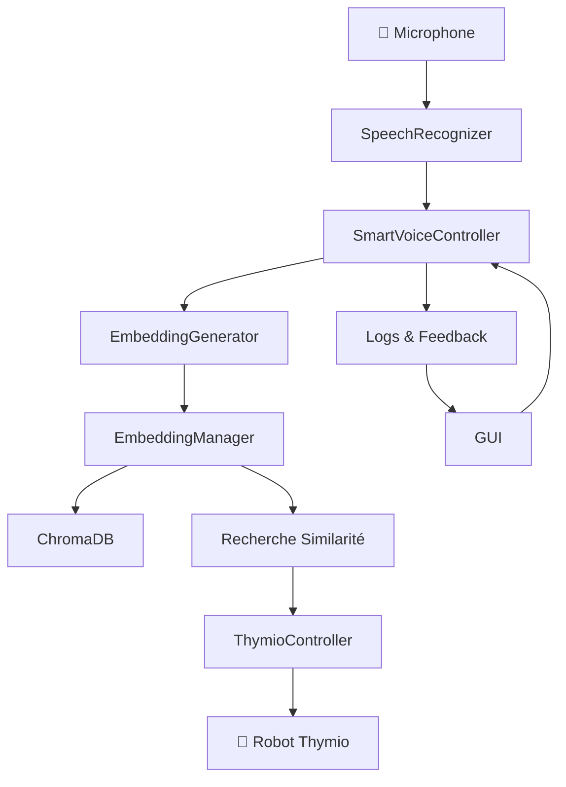

# 📖 Documentation Complète - VoxThymio 🤖🎤

> **Système Avancé de Contrôle Vocal pour Robot Thymio avec Intelligence Artificielle**  
> Développé par **Espérance AYIWAHOUN** pour **AI4Innov**


---

## 📋 Table des Matières

1. [Vue d'ensemble](#-vue-densemble)
2. [Architecture du Système](#-architecture-du-système)
3. [Installation et Configuration](#-installation-et-configuration)
4. [Modules et Classes](#-modules-et-classes)
5. [Interface Graphique](#-interface-graphique)
6. [Guide d'Utilisation](#-guide-dutilisation)
7. [API et Fonctionnalités](#-api-et-fonctionnalités)
9. [Dépannage](#-dépannage)
10. [Contribution](#-contribution)

---

## 🎯 Vue d'ensemble

### Qu'est-ce que VoxThymio ?

**VoxThymio** est un système révolutionnaire qui permet de contrôler un robot Thymio par la voix en utilisant l'intelligence artificielle. Le système comprend le langage naturel, apprend de nouvelles commandes dynamiquement et offre une interface intuitive pour l'interaction homme-machine.

### 🌟 Caractéristiques Principales

- **🎤 Reconnaissance Vocale Avancée** : Support de Whisper et SpeechRecognition
- **🧠 Compréhension Sémantique** : Utilise des embeddings multilingues
- **📚 Apprentissage Dynamique** : Ajout automatique de nouvelles commandes
- **🔍 Recherche Vectorielle** : Base de données ChromaDB optimisée
- **🤖 Contrôle Natif Thymio** : Communication directe via tdmclient
- **🎨 Interface Graphique** : Interface moderne et intuitive
- **⚙️ Configuration Flexible** : Seuils et paramètres ajustables

### 🎨 Captures d'écran

```
┌─────────────────────────────────────────────────────────┐
│ VoxThymio v1.0 - AI4Innov                             │
├─────────────────┬───────────────────────────────────────┤
│ 🎤 CONTRÔLE     │ 📚 GESTION DES COMMANDES              │
│ VOCAL           │                                       │
│                 │ ┌─ Bibliothèque ─ Nouvelle ─ Assistant ┤
│ [🎙️ ÉCOUTER]    │ │                                     │
│ [⏸️ PAUSE  ]     │ │ • avancer → Faire avancer le robot  │
│ [🛑 ARRÊT  ]     │ │ • reculer → Faire reculer le robot  │
│                 │ │ • tourner → Faire tourner le robot  │
│ Mode apprentis. │ │ • arrêter → Arrêter le robot        │
│ ☑️ Actif        │ │                                     │
│                 │ └─────────────────────────────────────┤
│ Seuils:         │                                       │
│ Exécution: 0.5  │                                       │
│ Apprentiss: 0.85│                                       │
└─────────────────┴───────────────────────────────────────┤
│ 🤖 Thymio: Connecté | 🎤 Audio: Actif | Commandes: 5    │
└─────────────────────────────────────────────────────────┘
```

---

## 🏗️ Architecture du Système

### 📁 Structure des Dossiers

```
VoxThymio/
├── 📁 src/                          # Code source principal
│   ├── 🐍 smart_voice_controller.py  # Contrôleur principal
│   ├── 🐍 speech_recognizer.py       # Reconnaissance vocale
│   ├── 🐍 embedding_generator.py     # Génération d'embeddings
│   ├── 🐍 embedding_manager.py       # Gestionnaire base vectorielle
│   ├── 📄 commands.json              # Commandes de base
│   ├── 🐍 __init__.py               # Package init
│   └── 📁 controller/               # Contrôleur Thymio
│       ├── 🐍 thymio_controller.py   # Interface Thymio
│       └── 🐍 __init__.py           # Package init
├── 📁 gui/                          # Interface graphique
│   ├── 🐍 voxthymio_gui.py          # Interface principale
│   ├── 🐍 launcher.py               # Lanceur d'interface
│   ├── 📄 config.json               # Configuration GUI
│   ├── 🖼️ robot.ico                 # Icône application
│   └── 📋 README.md                 # Doc interface
├── 📁 vector_db/                    # Base de données ChromaDB
├── 📁 __pycache__/                  # Cache Python
├── 🐍 main.py                       # Point d'entrée principal
├── 📋 README.md                     # Documentation principale
├── 📋 README_EN.md                  # Documentation anglaise
├── 📄 requirements.txt              # Dépendances Python
└── ⚙️ start_voxthymio.bat          # Script Windows
```

### 🔄 Flux de Données



### 🧩 Composants Principaux

| Composant | Rôle | Technologie |
|-----------|------|-------------|
| **Speech Recognition** | Conversion voix → texte | Whisper + SpeechRecognition |
| **Embedding Generator** | Texte → vecteurs sémantiques | Sentence Transformers |
| **Vector Database** | Stockage et recherche | ChromaDB |
| **Thymio Controller** | Communication robot | tdmclient |
| **GUI** | Interface utilisateur | Tkinter |

---

## 🚀 Installation et Configuration

### 🔧 Prérequis Système

- **Python** : Version 3.8 ou supérieure
- **Robot Thymio** : Avec firmware compatible
- **Microphone** : Dispositif audio fonctionnel
- **Système d'exploitation** : Windows, macOS, Linux
- **Mémoire** : 4 GB RAM minimum (8 GB recommandé)
- **Espace disque** : 2 GB disponibles

### 📥 Installation

#### 1. Cloner le Repository

```bash
git clone https://github.com/TitanSage02/Vox-Thymio.git
cd VoxThymio
```

#### 2. Installer les Dépendances

```bash
# Installation standard
pip install -r requirements.txt

# Installation avec cache (recommandé)
pip install --cache-dir ./cache -r requirements.txt
```

#### 3. Configuration Audio (Windows)

```bash
# Si pyaudio pose problème
pip install pipwin
pipwin install pyaudio

# Alternative
conda install pyaudio
```

#### 4. Test d'Installation

```bash
# Vérifier les composants
python -c "import tdmclient, transformers, chromadb; print('✅ Modules OK')"

# Test de base
python main.py --test
```

### ⚙️ Configuration Système

#### Configuration Principale (`gui/config.json`)

```json
{
    "application": {
        "name": "VoxThymio",
        "version": "1.0",
        "developer": "Espérance AYIWAHOUN",
        "organization": "AI4Innov"
    },
    "ui": {
        "theme": "cyberpunk_hack",
        "colors": {
            "primary": "#00ff41",
            "secondary": "#0d1117",
            "background": "#010409"
        },
        "window": {
            "width": 1200,
            "height": 800,
            "min_width": 1000,
            "min_height": 700
        }
    },
    "voice": {
        "language": "fr-FR",
        "model_size": "small",
        "execution_threshold": 0.5,
        "learning_threshold": 0.85
    },
    "thymio": {
        "connection_timeout": 10,
        "command_timeout": 5
    }
}
```

---

## 🧬 Modules et Classes

### 🎛️ SmartVoiceController

**Fichier** : `src/smart_voice_controller.py`

Le contrôleur principal qui orchestre tout le système de reconnaissance vocale et d'exécution de commandes.

#### 📋 Classe Principale

```python
class SmartVoiceController:
    """
    Contrôleur vocal principal pour VoxThymio.
    Gère la reconnaissance, l'analyse sémantique et l'exécution.
    """
```

#### 🔧 Méthodes Clés

| Méthode | Description | Paramètres | Retour |
|---------|-------------|------------|--------|
| `__init__(thymio_controller)` | Initialise le contrôleur | `ThymioController` | None |
| `process_command(user_input)` | Traite une commande textuelle | `str` | `Dict[str, Any]` |
| `voice_recognition()` | Lance la reconnaissance vocale | None | None |
| `add_new_command(command_id, description, code)` | Ajoute une nouvelle commande | `str, str, str` | `bool` |
| `update_thresholds(exec_threshold, learn_threshold)` | Met à jour les seuils | `float, float` | None |
| `get_system_stats()` | Statistiques du système | None | `Dict[str, Any]` |

#### 🔄 Pipeline de Traitement

```python
async def process_command(self, user_input: str) -> Dict[str, Any]:
    """
    1. Validation et normalisation de l'entrée
    2. Génération de l'embedding sémantique
    3. Recherche de similarité dans la base vectorielle
    4. Décision d'exécution ou d'apprentissage
    5. Exécution de la commande via ThymioController
    """
```

### 🎤 SpeechRecognizer

**Fichier** : `src/speech_recognizer.py`

Module de reconnaissance vocale temps réel avec support multi-moteur.

#### 📋 Classe Principale

```python
class SpeechRecognizer:
    """
    Reconnaissance vocale avec support Whisper et SpeechRecognition.
    Optimisé pour le français avec fallback automatique.
    """
```

#### 🔧 Configuration

| Paramètre | Valeur par défaut | Description |
|-----------|-------------------|-------------|
| `language` | `"fr"` | Code langue |
| `model_size` | `"small"` | Taille modèle Whisper |
| `sample_rate` | `16000` | Fréquence échantillonnage |
| `chunk_duration` | `5.0` | Durée chunks audio |
| `energy_threshold` | `300` | Seuil détection voix |

#### 🎯 Méthodes Principales

```python
# Reconnaissance continue
async def listen_continuously(self) -> AsyncIterator[str]:
    """Générateur de reconnaissance continue"""

# Reconnaissance ponctuelle  
def recognize_once(self, audio_data) -> str:
    """Reconnaissance d'un échantillon audio"""

# Configuration dynamique
def update_settings(self, **kwargs):
    """Mise à jour configuration"""
```

### 🧠 EmbeddingGenerator

**Fichier** : `src/embedding_generator.py`

Générateur d'embeddings sémantiques pour la compréhension du langage naturel.

#### 📋 Classe Principale

```python
class EmbeddingGenerator:
    """
    Génère des embeddings sémantiques multilingues
    avec Sentence Transformers.
    """
```

#### 🤖 Modèle Utilisé

- **Nom** : `paraphrase-multilingual-MiniLM-L12-v2`
- **Taille** : ~118MB
- **Langues** : 50+ langues dont français
- **Dimensions** : 384 dimensions
- **Performance** : Optimisé pour la similarité sémantique

#### 🔧 Méthodes Principales

```python
def generate_embedding(self, text: str) -> np.ndarray:
    """Génère un embedding pour un texte"""

def generate_batch_embeddings(self, texts: List[str]) -> np.ndarray:
    """Génère des embeddings par batch"""

def calculate_similarity(self, embedding1: np.ndarray, embedding2: np.ndarray) -> float:
    """Calcule la similarité cosinus"""
```

### 🗄️ EmbeddingManager

**Fichier** : `src/embedding_manager.py`

Gestionnaire de base vectorielle ChromaDB pour le stockage et la recherche d'embeddings.

#### 📋 Classe Principale

```python
class EmbeddingManager:
    """
    Gestionnaire de base vectorielle ChromaDB pour
    le stockage et la recherche de commandes.
    """
```

#### 🏗️ Structure Base de Données

```python
# Collection ChromaDB
collection_name = "voxthymio_commands"
metadata = {"hnsw:space": "cosine"}  # Distance cosinus

# Structure d'un document
{
    "id": "command_id",
    "embedding": [0.1, 0.2, ...],  # 384 dimensions
    "metadata": {
        "description": "description de la commande",
        "code": "code Aseba",
        "created_at": "timestamp",
        "usage_count": 0
    }
}
```

#### 🔧 Méthodes Principales

| Méthode | Description | Complexité |
|---------|-------------|------------|
| `add_command()` | Ajouter une commande | O(log n) |
| `get_best_match()` | Recherche de similarité | O(log n) |
| `search_similar_commands()` | Recherche multiple | O(k log n) |
| `update_command()` | Modifier une commande | O(log n) |
| `delete_command()` | Supprimer une commande | O(log n) |
| `get_all_commands()` | Lister toutes les commandes | O(n) |

### 🤖 ThymioController

**Fichier** : `src/controller/thymio_controller.py`

Interface de communication avec le robot Thymio via le protocole Aseba.

#### 📋 Classe Principale

```python
class ThymioController:
    """
    Contrôleur pour la communication avec le robot Thymio.
    Utilise tdmclient pour les communications Aseba.
    """
```

#### 🔌 Protocole de Communication

```python
# Connexion
await client.wait_for_status(client.NODE_STATUS_AVAILABLE)
node = client.first_node()
await node.lock_node()

# Exécution de commande
await node.send_set_variables({
    "motor.left.target": 200,
    "motor.right.target": 200
})

# Lecture de capteurs
sensors = await node.wait_for_variables({"prox.horizontal"})
```

#### 🎯 Commandes Supportées

| Catégorie | Commandes | Code Aseba |
|-----------|-----------|------------|
| **Mouvement** | avancer, reculer | `motor.left/right.target = ±200` |
| **Rotation** | tourner_gauche, tourner_droite | `motor.left = -100, motor.right = 100` |
| **Arrêt** | arreter, stop | `motor.left/right.target = 0` |
| **Capteurs** | lire_proximètres | `call prox.all` |
| **LEDs** | allumer_leds | `call leds.circle(r,g,b,...)` |

---

## 🎨 Interface Graphique

### 🖥️ VoxThymioGUI

**Fichier** : `gui/voxthymio_gui.py`

Interface graphique moderne développée avec Tkinter, offrant un contrôle complet du système.

#### 📋 Classe Principale

```python
class VoxThymioGUI:
    """
    Interface graphique principale de VoxThymio.
    Interface moderne avec thème cyberpunk configurable.
    """
```

#### 🏗️ Architecture Interface

```
┌─────────────────────────────────────────────────────────┐
│                    TITRE APPLICATION                    │
├─────────────────┬───────────────────────────────────────┤
│                 │                                       │
│   CONTRÔLE      │        GESTION COMMANDES              │
│   VOCAL         │                                       │
│                 │  ┌─ Bibliothèque ┬─ Nouvelle ┬─ Assis.┤
│ • Boutons       │  │                │           │       │
│ • Seuils        │  │ Liste commands │ Créer cmd │ Help  │
│ • Mode          │  │ Recherche      │ Test      │ Temps │
│ • Feedback      │  │ Modification   │ Code      │ Tips  │
│                 │  └────────────────┴───────────┴───────┤
├─────────────────┴───────────────────────────────────────┤
│ STATUS BAR : Connexions, Stats, Mode, Développeur      │
└─────────────────────────────────────────────────────────┘
```

#### 🎨 Zones Fonctionnelles

##### 1. 🎤 Zone Contrôle Vocal (Gauche)

```python
# Boutons principaux
self.listen_button = CTkButton(
    text="🎙️ ÉCOUTER",
    command=self.toggle_listening,
    fg_color=self.colors['success']
)

# Configuration seuils
self.execution_threshold_slider = CTkSlider(
    from_=0.0, to=1.0,
    command=self.update_execution_threshold
)

# Mode apprentissage
self.learning_mode_checkbox = CTkCheckBox(
    text="Mode Apprentissage",
    variable=self.is_learning_mode
)
```

##### 2. 📚 Zone Gestion Commandes (Droite)

```python
# Onglets principaux
self.command_notebook = ttk.Notebook(self.right_frame)

# Onglet Bibliothèque
self.library_frame = self.create_library_tab()

# Onglet Nouvelle Commande  
self.new_command_frame = self.create_new_command_tab()

# Onglet Assistant
self.assistant_frame = self.create_assistant_tab()
```

##### 3. 📊 Barre d'État (Bas)

```python
# Informations système
self.status_labels = {
    'thymio': Label(text="🤖 Thymio: Déconnecté"),
    'audio': Label(text="🎤 Audio: Inactif"),
    'commands': Label(text="📚 Commandes: 0"),
    'latency': Label(text="⚡ Latence: 0ms")
}
```

#### 🔧 Méthodes Principales

| Méthode | Description | Événement |
|---------|-------------|-----------|
| `toggle_listening()` | Active/Désactive l'écoute | Clic bouton |
| `on_command_recognized()` | Traite commande reconnue | Callback |
| `add_new_command()` | Ajoute nouvelle commande | Validation form |
| `test_command_similarity()` | Test de similarité | Bouton test |
| `update_command_list()` | Refresh liste commandes | Changement BD |
| `save_configuration()` | Sauvegarde config | Fermeture app |

#### 🎨 Thématisation

Le système utilise un thème cyberpunk configurable :

```python
# Couleurs principales
COLORS = {
    'primary': '#00ff41',      # Vert Matrix
    'secondary': '#0d1117',    # Noir GitHub
    'background': '#010409',   # Noir profond
    'text_dark': '#c9d1d9',    # Gris clair
    'text_light': '#00ff41',   # Vert accent
    'success': '#39ff14',      # Vert succès
    'warning': '#ffaa00',      # Orange warning
    'danger': '#ff073a',       # Rouge erreur
    'accent': '#00d4ff',       # Bleu accent
    'terminal': '#0a0e0a',     # Vert terminal
    'card': '#161b22',         # Gris carte
    'border': '#21262d',       # Bordure
    'hover': '#238636'         # Survol
}
```

---

## 📖 Guide d'Utilisation

### 🚀 Démarrage Rapide

#### 1. Lancement de l'Application

```bash
# Méthode 1 : Script principal
python main.py

# Méthode 2 : Interface directe
cd gui
python launcher.py

# Méthode 3 : Script Windows
start_voxthymio.bat
```

#### 2. Connexion du Robot

1. **Brancher le Thymio** via USB ou Bluetooth
2. **Allumer le robot** (bouton central 3 secondes)
3. **Vérifier la connexion** dans la barre d'état
4. **Attendre** le statut "🤖 Thymio: Connecté"

#### 3. Premier Contrôle Vocal

1. **Cliquer** sur "🎙️ ÉCOUTER"
2. **Parler clairement** : "avance"
3. **Observer** le robot exécuter la commande
4. **Dire** "arrête" pour stopper

### 🎯 Utilisation Avancée

#### 📚 Gestion des Commandes

##### Créer une Nouvelle Commande

1. **Aller** à l'onglet "Nouvelle Commande"
2. **Saisir** la description : "fais une danse"
3. **Écrire** le code Aseba :
   ```aseba
   motor.left.target = 200
   motor.right.target = -200
   timer.period[0] = 500
   ```
4. **Tester** la similarité
5. **Sauvegarder** la commande

##### Modifier une Commande Existante

1. **Aller** à l'onglet "Bibliothèque"
2. **Sélectionner** la commande à modifier
3. **Cliquer** sur "Modifier"
4. **Ajuster** description ou code
5. **Valider** les changements

#### ⚙️ Configuration des Seuils

##### Seuil d'Exécution (0.0 - 1.0)
- **0.3-0.5** : Permissif (exécute facilement)
- **0.5-0.7** : Équilibré (recommandé)
- **0.7-1.0** : Strict (exécution précise)

##### Seuil d'Apprentissage (0.7 - 1.0)
- **0.7-0.8** : Apprentissage agressif
- **0.8-0.9** : Apprentissage modéré (recommandé)
- **0.9-1.0** : Apprentissage conservateur

#### 🧠 Mode Apprentissage

Quand activé, le système :

1. **Analyse** les commandes non reconnues
2. **Propose** d'apprendre de nouvelles variantes
3. **Ajoute automatiquement** les commandes similaires
4. **Améliore** la reconnaissance au fil du temps

### 🎤 Commandes Vocales

#### 📋 Commandes de Base

| Catégorie | Exemples de Commandes | Variations Acceptées |
|-----------|----------------------|---------------------|
| **Avancer** | "avance", "va devant" | "va tout droit", "bouge vers l'avant" |
| **Reculer** | "recule", "va derrière" | "marche arrière", "retourne" |
| **Tourner Gauche** | "tourne à gauche", "va à gauche" | "pivote gauche", "demi-tour gauche" |
| **Tourner Droite** | "tourne à droite", "va à droite" | "pivote droite", "demi-tour droite" |
| **Arrêter** | "arrête", "stop" | "arrête-toi", "stoppe", "halt" |

#### 🎯 Commandes Avancées (Exemples)

```python
# Commandes de mouvement complexe
"fais un carré"         → Séquence: avancer → droite → avancer → droite...
"tourne en rond"        → Rotation continue
"zigzague"              → Mouvement en zigzag

# Commandes de capteurs
"évite les obstacles"   → Utilisation des proximètres
"suis la ligne"         → Suivi de ligne avec capteurs sol
"cherche la lumière"    → Phototaxie

# Commandes d'interaction
"clignote rouge"        → LEDs rouges clignotantes
"joue une mélodie"      → Séquence de sons
```

---

## 🔌 API et Fonctionnalités

### 🐍 API Python

#### SmartVoiceController API

```python
from src.smart_voice_controller import SmartVoiceController
from src.controller.thymio_controller import ThymioController

# Initialisation
thymio = ThymioController()
await thymio.connect()
controller = SmartVoiceController(thymio)

# Traitement de commande
result = await controller.process_command("avance rapidement")
print(result)
# {'status': 'success', 'command_id': 'avancer', 'similarity': 0.85}

# Ajout de commande
controller.add_new_command(
    command_id="spin_dance",
    description="faire une danse qui tourne",
    code="motor.left.target = 300\nmotor.right.target = -300"
)

# Configuration des seuils
controller.update_thresholds(
    execution_threshold=0.6,
    learning_threshold=0.9
)

# Statistiques
stats = controller.get_system_stats()
print(f"Commandes: {stats['database']['total_commands']}")
```

#### EmbeddingManager API

```python
from src.embedding_manager import EmbeddingManager

# Initialisation
db = EmbeddingManager()

# Ajout de commande
embedding = [0.1, 0.2, ...]  # 384 dimensions
db.add_command(
    command_id="custom_move",
    embedding=embedding,
    description="mouvement personnalisé",
    code="motor.left.target = 150"
)

# Recherche
results = db.search_similar_commands(query_embedding, n_results=5)
for result in results:
    print(f"{result['command_id']}: {result['similarity']:.3f}")

# Meilleure correspondance
best = db.get_best_match(query_embedding, threshold=0.5)
if best:
    print(f"Commande: {best['metadata']['description']}")
```

#### ThymioController API

```python
from src.controller.thymio_controller import ThymioController

# Connexion
thymio = ThymioController()
connected = await thymio.connect()

if connected:
    # Mouvement
    await thymio.move_forward(speed=200)
    await thymio.move_backward(speed=150)
    await thymio.turn_left(speed=100)
    await thymio.stop()
    
    # Capteurs
    sensors = await thymio.read_sensors()
    print(f"Proximité: {sensors['proximity']}")
    
    # LEDs
    await thymio.set_leds(r=255, g=0, b=0)  # Rouge
    
    # Code Aseba personnalisé
    await thymio.execute_code("""
        motor.left.target = 200
        motor.right.target = -200
        timer.period[0] = 1000
    """)
```

## 🚨 Dépannage

### 🔧 Problèmes Courants

#### 1. Erreur de Connexion Thymio

**Symptômes :**
```
❌ Aucun robot Thymio détecté
❌ Timeout de connexion
```

**Solutions :**
```bash
# Vérifier les processus conflictuels
tasklist | findstr "Thymio"
# Tuer Thymio Suite si nécessaire

# Redémarrer le robot
# 1. Éteindre (bouton 3s)
# 2. Débrancher USB
# 3. Rebrancher USB
# 4. Rallumer (bouton 3s)

# Vérifier les permissions
# Windows: Exécuter en tant qu'administrateur
# Linux: Ajouter utilisateur au groupe dialout
sudo usermod -a -G dialout $USER
```

#### 2. Erreur Audio/Microphone

**Symptômes :**
```
❌ No Default Input Device Available
❌ Microphone permission denied
```

**Solutions :**
```python
# Test du microphone
import pyaudio
p = pyaudio.PyAudio()
print("Périphériques disponibles:")
for i in range(p.get_device_count()):
    info = p.get_device_info_by_index(i)
    print(f"{i}: {info['name']}")

# Configuration manuelle
speech_recognizer = SpeechRecognizer(
    device_index=1,  # Index du bon microphone
    energy_threshold=4000  # Ajuster selon environnement
)
```

**Windows - Permissions :**
1. Paramètres → Confidentialité → Microphone
2. Autoriser les applications à accéder au microphone
3. Autoriser les applications de bureau

#### 3. Problèmes de Performance

**Symptômes :**
```
⚠️ Reconnaissance lente (>5s)
⚠️ Usage mémoire élevé (>2GB)
```

**Solutions :**
```python
# Réduire la taille du modèle Whisper
speech_recognizer = SpeechRecognizer(model_size="tiny")

# Limiter le cache des embeddings
@lru_cache(maxsize=500)  # Réduire de 1000 à 500

# Nettoyer la base vectorielle
embedding_manager.cleanup_old_commands(days=30)
```

#### 4. Erreurs d'Import

**Symptômes :**
```
❌ ModuleNotFoundError: No module named 'transformers'
❌ ImportError: cannot import name 'SentenceTransformer'
```

**Solutions :**
```bash
# Réinstallation complète
pip uninstall -y transformers sentence-transformers torch
pip install --no-cache-dir transformers sentence-transformers torch

# Vérification de l'environnement
python -c "import sys; print(sys.path)"
pip list | grep -E "(transformers|sentence|torch)"

# Installation alternative
conda install -c conda-forge transformers sentence-transformers
```

### 📋 Diagnostic Automatique

```python
# Script de diagnostic inclus
python main.py --diagnostic

# Résultat attendu:
"""
🔍 Diagnostic VoxThymio
======================

✅ Python 3.9.7 (compatible)
✅ Modules requis installés
✅ Permissions microphone OK
⚠️ Thymio non détecté
✅ Base vectorielle initialisée
✅ Modèle d'embedding chargé

🎯 Recommandations:
- Connecter et allumer le robot Thymio
- Fermer Thymio Suite si ouvert

💡 Exécuter: python main.py --fix-thymio
"""
```

### 🆘 Support et Communauté

#### Canaux d'Aide

- **GitHub Issues** : [Créer un issue](https://github.com/TitanSage02/Vox-Thymio/issues)
- **Documentation** : [Wiki du projet](https://github.com/TitanSage02/Vox-Thymio/wiki)
- **Email Support** : support@ai4innov.com

#### Informations à Fournir

```bash
# Générer un rapport complet
python main.py --support-report > support_report.txt
```

Le rapport inclut :
- Version Python et modules
- Configuration système
- Logs des dernières erreurs
- État des connexions
- Métriques de performance

---

## 🤝 Contribution

### 🚀 Comment Contribuer

#### 1. Configuration Développement

```bash
# Fork et clone
git clone https://github.com/VOTRE_USERNAME/Vox-Thymio.git
cd VoxThymio

# Environnement virtuel
python -m venv venv
source venv/bin/activate  # Linux/Mac
# ou
venv\Scripts\activate     # Windows

# Installation en mode développement
pip install -e .
pip install -r requirements-dev.txt
```

#### 2. Standards de Code

```python
# Style de code : PEP 8 + Black
# Taille de ligne : 88 caractères
# Quotes : Double quotes préférées
# Imports : Organisation automatique avec isort

# Exemple de fonction bien documentée
def process_voice_command(
    audio_data: np.ndarray,
    language: str = "fr-FR",
    confidence_threshold: float = 0.8
) -> Dict[str, Any]:
    """
    Traite une commande vocale et retourne le résultat.
    
    Args:
        audio_data: Données audio brutes (16kHz, mono)
        language: Code langue pour la reconnaissance
        confidence_threshold: Seuil de confiance minimum
        
    Returns:
        Dictionnaire contenant:
        - status: 'success' | 'error' | 'low_confidence'
        - text: Texte reconnu
        - confidence: Score de confiance (0-1)
        - execution_time: Temps de traitement (ms)
        
    Raises:
        AudioError: Si les données audio sont invalides
        ModelError: Si le modèle de reconnaissance échoue
        
    Example:
        >>> result = process_voice_command(audio, "fr-FR", 0.8)
        >>> print(result['text'])
        'avance lentement'
    """
```

#### 3. Workflow Git

```bash
# Créer une branche feature
git checkout -b feature/nouvelle-fonctionnalite

# Commits atomiques et descriptifs
git commit -m "feat: ajouter reconnaissance vocale multilingue

- Support pour anglais, français, espagnol
- Détection automatique de la langue
- Tests unitaires ajoutés
- Documentation mise à jour

Closes #123"

# Push et Pull Request
git push origin feature/nouvelle-fonctionnalite
# Ouvrir PR sur GitHub avec template
```

#### 4. Types de Contributions

| Type | Description | Exemples |
|------|-------------|----------|
| **🐛 Bug Fix** | Correction d'erreur | Fixe crash, comportement incorrect |
| **✨ Feature** | Nouvelle fonctionnalité | Nouveau module, API endpoint |
| **📝 Documentation** | Amélioration docs | README, docstrings, guides |
| **🎨 UI/UX** | Interface utilisateur | Design, ergonomie, accessibilité |
| **⚡ Performance** | Optimisation | Vitesse, mémoire, efficacité |
| **🧪 Tests** | Tests et validation | Tests unitaires, intégration |
| **🔧 Tooling** | Outils développement | Scripts, CI/CD, linting |


### 🏆 Reconnaissance

#### Hall of Fame

| Contributeur | Contributions | Spécialité |
|--------------|---------------|------------|
| **TitanSage02** | Core development | Architecture, IA |
| **AI4Innov Team** | Research, validation | Robotique |

#### Comment être Reconnu

- **Code de qualité** : Suivre les standards
- **Tests complets** : Couvrir les cas d'usage
- **Documentation claire** : Aider les autres
- **Participation communauté** : Issues, discussions
- **Innovation** : Nouvelles idées, solutions créatives

---

## 📄 Annexes

### 📚 Glossaire

| Terme | Définition |
|-------|------------|
| **Embedding** | Représentation vectorielle d'un texte dans un espace sémantique |
| **Similarité Cosinus** | Mesure de similarité entre deux vecteurs (0 à 1) |
| **ChromaDB** | Base de données vectorielle optimisée pour l'IA |
| **Aseba** | Langage de programmation pour robots éducatifs |
| **tdmclient** | Client Python pour communication avec Thymio |
| **Whisper** | Modèle de reconnaissance vocale d'OpenAI |
| **Sentence Transformers** | Bibliothèque pour génération d'embeddings |
| **Pipeline** | Séquence de traitements automatisés |
| **Threshold** | Seuil de décision pour l'exécution ou l'apprentissage |

### 🔗 Références

#### Documentation Technique

- [Thymio Programming Reference](https://www.thymio.org/programming/)
- [ChromaDB Documentation](https://docs.trychroma.com/)
- [Sentence Transformers](https://www.sbert.net/)
- [OpenAI Whisper](https://openai.com/research/whisper)
- [tdmclient API](https://pypi.org/project/tdmclient/)

#### Articles et Recherches

- "Attention Is All You Need" - Transformer Architecture
- "Sentence-BERT: Sentence Embeddings using Siamese BERT-Networks"

#### Tutoriels et Guides

- [Getting Started with Thymio](https://www.thymio.org/getting-started/)
- [Python Audio Processing](https://python-sounddevice.readthedocs.io/)
- [Vector Databases Guide](https://www.pinecone.io/learn/vector-database/)

### 📊 Spécifications Techniques

#### Configuration Minimale

| Composant | Minimum | Recommandé |
|-----------|---------|------------|
| **CPU** | 2 cores 2GHz | 4 cores 3GHz |
| **RAM** | 4 GB | 8 GB |
| **Stockage** | 1 GB libre | 5 GB libre |
| **Audio** | Microphone USB | Microphone de qualité |
| **Robot** | Thymio II | Thymio II Wireless |

#### Formats Supportés

| Type | Formats | Notes |
|------|---------|-------|
| **Audio** | WAV, MP3, FLAC | 16kHz recommandé |
| **Configuration** | JSON | UTF-8 encoding |
| **Sauvegarde** | JSON, SQLite | Backup incrémental |


## 📜 Licence et Mentions Légales

### 📄 Licence MIT

```
MIT License

Copyright (c) 2024 Espérance AYIWAHOUN - AI4Innov

Permission is hereby granted, free of charge, to any person obtaining a copy
of this software and associated documentation files (the "Software"), to deal
in the Software without restriction, including without limitation the rights
to use, copy, modify, merge, publish, distribute, sublicense, and/or sell
copies of the Software, and to permit persons to whom the Software is
furnished to do so, subject to the following conditions:

The above copyright notice and this permission notice shall be included in all
copies or substantial portions of the Software.

THE SOFTWARE IS PROVIDED "AS IS", WITHOUT WARRANTY OF ANY KIND, EXPRESS OR
IMPLIED, INCLUDING BUT NOT LIMITED TO THE WARRANTIES OF MERCHANTABILITY,
FITNESS FOR A PARTICULAR PURPOSE AND NONINFRINGEMENT. IN NO EVENT SHALL THE
AUTHORS OR COPYRIGHT HOLDERS BE LIABLE FOR ANY CLAIM, DAMAGES OR OTHER
LIABILITY, WHETHER IN AN ACTION OF CONTRACT, TORT OR OTHERWISE, ARISING FROM,
OUT OF OR IN CONNECTION WITH THE SOFTWARE OR THE USE OR OTHER DEALINGS IN THE
SOFTWARE.
```

### 🙏 Remerciements

#### Organisations et Projets

- **[Mobsya](https://www.mobsya.org/)** - Développeur du robot Thymio
- **[OpenAI](https://openai.com/)** - Modèle Whisper
- **[Hugging Face](https://huggingface.co/)** - Modèles de langage
- **[ChromaDB](https://www.trychroma.com/)** - Base vectorielle
- **[Python Software Foundation](https://www.python.org/)** - Langage Python

#### Bibliothèques Open Source

- **SentenceTransformers** - Embeddings sémantiques
- **PyTorch** - Framework d'apprentissage automatique
- **Tkinter** - Interface graphique
- **NumPy** - Calcul numérique

### 📞 Contact

#### Équipe de Développement

- **Développeur Principal** : Espérance AYIWAHOUN
- **Organisation** : AI4Innov
- **Email** : contact@ai4innov.com
- **GitHub** : [@TitanSage02](https://github.com/TitanSage02)

#### Support et Communauté

- **Issues GitHub** : [Reporter un problème](https://github.com/TitanSage02/Vox-Thymio/issues)
- **Discussions** : [Forum communauté](https://github.com/TitanSage02/Vox-Thymio/discussions)
- **Documentation** : [Wiki du projet]()

---


### 🚀 Vision Long Terme

VoxThymio aspire à devenir la **plateforme de référence** pour le contrôle vocal de robots éducatifs, en démocratisant l'accès à l'intelligence artificielle et à la robotique pour tous.

---

**VoxThymio v1.0** - *Donnez une voix à vos robots !* 🤖🗣️


---

*© 2024 Espérance AYIWAHOUN - AI4Innov. Tous droits réservés sous licence MIT.*
