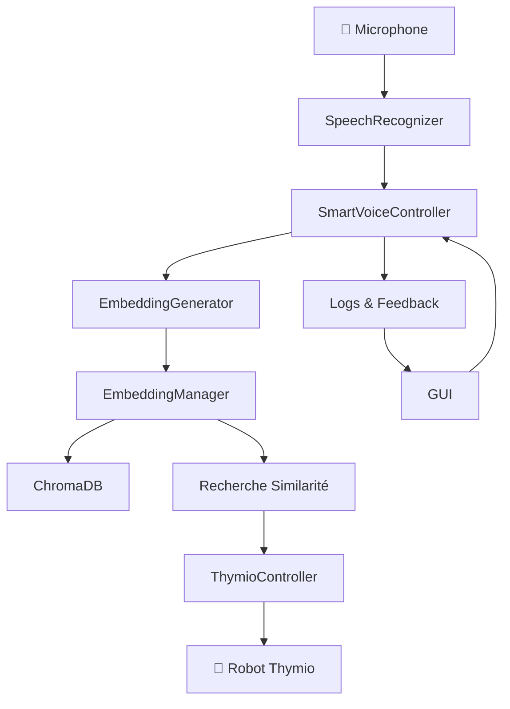

# 📖 Documentation Complète - VoxThymio 🤖🎤

> **Système avancé de contrôle vocal pour le robot Thymio avec Intelligence Artificielle**
 
> Développé par **Espérance AYIWAHOUN** pour **AI4Innov**


## 📋 Table des matières

1. [Vue d'ensemble](#-vue-densemble)
2. [Architecture du système](#-architecture-du-système)
3. [Installation et configuration](#-installation-et-configuration)
4. [Modules et classes](#-modules-et-classes)
5. [Interface graphique](#-interface-graphique)
6. [Guide d'utilisation](#-guide-dutilisation)
7. [API et fonctionnalités](#-api-et-fonctionnalités)
8. [FAQ](#-faq)
9. [Dépannage](#-dépannage)
10. [Contribution](#-contribution)

---

## 🎯 Vue d'ensemble

### Audience cible

Cette documentation s’adresse principalement à des **développeurs** et **chercheurs** souhaitant utiliser, étendre ou analyser le système VoxThymio.

### Qu'est-ce que VoxThymio ?

**VoxThymio** est un système révolutionnaire qui permet de contrôler un robot Thymio par la voix en utilisant l'intelligence artificielle. Le système comprend le langage naturel, apprend de nouvelles commandes dynamiquement et offre une interface intuitive pour l'interaction homme-machine.

### 🌟 Caractéristiques principales

* **🎤 Reconnaissance vocale avancée** : Support de Whisper et SpeechRecognition
* **🧠 Compréhension sémantique** : Utilise des embeddings multilingues
* **📚 Apprentissage dynamique** : Ajout automatique de nouvelles commandes
* **🔍 Recherche vectorielle** : Base de données ChromaDB optimisée
* **🤖 Contrôle natif Thymio** : Communication directe via tdmclient
* **🎨 Interface graphique** : Interface moderne et intuitive
* **⚙️ Configuration flexible** : Seuils et paramètres ajustables

### 🎨 Captures d'écran

```
┌─────────────────────────────────────────────────────────┐
│                VoxThymio v1.0 - AI4Innov                │
├─────────────────┬───────────────────────────────────────┤
│ 🎤 CONTRÔLE     │📚 GESTION DES COMMANDES              │
│ VOCAL           │                                       │
│                 │┌─ Bibliothèque ─ Nouvelle ─ Assistant ┤
│ [🎙️ ÉCOUTER]    │ │                                    │
│ [⏸️ PAUSE  ]    │ │ • avancer → Faire avancer le robot │
│ [🛑 ARRÊT  ]    │ │ • reculer → Faire reculer le robot │
│                 │ │ • tourner → Faire tourner le robot  │
│ Mode apprentis. │ │ • arrêter → Arrêter le robot        │
│ ☑️ Actif        │ │                                     │
│                 │ └─────────────────────────────────────┤
│ Seuils:         │                                       │
│ Exécution: 0.5  │                                       │
│ Apprentiss: 0.85│                                       │
└─────────────────┴───────────────────────────────────────┤
│ 🤖 Thymio: Connecté | 🎤 Audio: Actif | Commandes: 5   │
└─────────────────────────────────────────────────────────┘
```

---

## 🏗️ Architecture du Système

### 📁 Structure des Dossiers

```
VoxThymio/
├── 📁 src/
│   ├── 🐍 smart_voice_controller.py
│   ├── 🐍 speech_recognizer.py
│   ├── 🐍 embedding_generator.py
│   ├── 🐍 embedding_manager.py
│   ├── 📄 commands.json
│   ├── 🐍 __init__.py
│   └── 📁 controller/
│       ├── 🐍 thymio_controller.py
│       └── 🐍 __init__.py
├── 📁 gui/
│   ├── 🐍 voxthymio_gui.py          
│   ├── 🐍 launcher.py               
│   ├── 📄 config.json
│   ├── 🖼️ robot.ico
│   └── 📋 README.md
├── 📁 vector_db/
├── 🐍 main.py
├── 📋 README.md
├── 📋 README_EN.md
|── 📄 requirements.txt
```

### 🔄 Flux de Données



### 🧩 Composants Principaux

| Composant               | Rôle                         | Technologie                 |
| ----------------------- | ---------------------------- | --------------------------- |
| **Speech Recognition**  | Conversion voix → texte      | Whisper + SpeechRecognition |
| **Embedding Generator** | Texte → vecteurs sémantiques | Sentence Transformers       |
| **Vector Database**     | Stockage et recherche        | ChromaDB                    |
| **Thymio Controller**   | Communication robot          | tdmclient                   |
| **GUI**                 | Interface utilisateur        | Tkinter                     |

---

## 🚀 Installation et Configuration

### 🔧 Prérequis système

* **Python** : Version 3.8 ou supérieure
* **Robot Thymio** : Avec firmware compatible
* **Microphone** : Dispositif audio fonctionnel
* **Système d'exploitation** : Windows, macOS, Linux
* **Mémoire** : 4 GB RAM minimum (8 GB recommandé)
* **Espace disque** : 2 GB disponibles

### 📥 Installation

#### 1. Cloner le Repository

```bash
git clone https://github.com/TitanSage02/Vox-Thymio.git
cd VoxThymio
```

#### 2. Installer les Dépendances

```bash
# Installation standard
pip install -r requirements.txt

# Installation avec cache (recommandé)
pip install --cache-dir ./cache -r requirements.txt
```

#### 3. Configuration Audio (Windows)

```bash
# Si pyaudio pose problème
pip install pipwin
pipwin install pyaudio

# Alternative
conda install pyaudio
```

#### 4. Test d'Installation

```bash
# Vérifier les composants
python -c "import tdmclient, transformers, chromadb; print('✅ Modules OK')"

# Test de base
python main.py --test
```

### ⚙️ Configuration Système

#### Configuration principale (`gui/config.json`)

```json
{
    "application": {
        "name": "VoxThymio",
        "version": "1.0",
        "developer": "Espérance AYIWAHOUN",
        "organization": "AI4Innov"
    },
    "ui": {
        "theme": "cyberpunk_hack",
        "colors": {
            "primary": "#00ff41",
            "secondary": "#0d1117",
            "background": "#010409"
        },
        "window": {
            "width": 1200,
            "height": 800,
            "min_width": 1000,
            "min_height": 700
        }
    },
    "voice": {
        "language": "fr-FR",
        "model_size": "small",
        "execution_threshold": 0.5,
        "learning_threshold": 0.85
    },
    "thymio": {
        "connection_timeout": 10,
        "command_timeout": 5
    }
}
```

---

## 🧬 Modules et Classes

*(Rappel succinct, voir doc complète initiale pour détails)*

* **SmartVoiceController** : Contrôle la reconnaissance, compréhension et exécution des commandes.
* **SpeechRecognizer** : Module vocal avec Whisper et SpeechRecognition.
* **EmbeddingGenerator** : Génération d’embeddings avec Sentence Transformers.
* **EmbeddingManager** : Gestion de la base ChromaDB.
* **ThymioController** : Interface de communication Aseba avec le robot Thymio.

---

## 🎨 Interface Graphique

GUI moderne en Tkinter avec thème cyberpunk, gestion des commandes, contrôle vocal, affichage des statuts et configuration des seuils.

---

## 📖 Guide d'Utilisation

### 🚀 Démarrage Rapide

1. **Lancer l’application** (`python main.py`, ou via interface GUI)
2. **Connecter le robot Thymio** (USB/Bluetooth, bouton 3s)
3. **Vérifier connexion dans la barre d’état** ("🤖 Thymio: Connecté")
4. **Cliquer sur "🎙️ ÉCOUTER" et donner des commandes vocales**

### 🎯 Utilisation Avancée

* Créer/modifier commandes via onglets GUI
* Ajuster seuils d’exécution (0.3-1.0) et apprentissage (0.7-1.0)
* Mode apprentissage : ajoute dynamiquement des commandes similaires

### 🎤 Commandes Vocales

* Commandes de base comme "avance", "recule", "tourne à gauche", etc.
* Commandes avancées (exemples dans doc initiale)

---

## 🧩 Gestion des Connexions et Erreurs

* **Perte de connexion Thymio** : L’utilisateur doit cliquer sur le bouton de reconnexion dans l’interface GUI.
* **Commandes non reconnues** : Si le seuil de similarité n’est pas atteint, le système propose les commandes les plus proches détectées.

---

## ⏱️ Performances

* Latence moyenne de la chaîne complète (détection vocale → exécution robot) : **3 à 5 secondes**

---

## 🔒 Confidentialité et Données

* Les **données vocales sont traitées en temps réel et non stockées**.
* Après transcription, l’audio est immédiatement perdu, garantissant la confidentialité.

---

## FAQ

### Q1 : Que faire si le Thymio ne se connecte pas ?

**R** : Vérifier que le robot est bien allumé, branché, puis cliquer sur le bouton de reconnexion dans l’interface.

### Q2 : Le système supporte-t-il plusieurs langues ?

**R** : Pour l’instant, seul le français est supporté.

### Q3 : Comment gérer les commandes non reconnues ?

**R** : Le système propose automatiquement des commandes proches en similarité lorsqu’il ne reconnaît pas exactement la commande.

### Q4 : Y a-t-il un mécanisme d’apprentissage automatique ?

**R** : Oui, en mode apprentissage actif, le système ajoute automatiquement des variantes proches des commandes déjà présentes.

### Q5 : Y a-t-il une suite de tests automatisés ?

**R** : Pas pour le moment, mais c’est prévu pour les versions futures.

---

## 🔌 API et Fonctionnalités

*(Voir documentation complète initiale — exemples d’API pour SmartVoiceController, EmbeddingManager, ThymioController)*

---

## 🚨 Dépannage

*(Voir documentation initiale pour erreurs fréquentes, solutions et script diagnostic)*

---

**VoxThymio v1.0** - *Donnez une voix à vos robots !* 🤖🗣️

© 2024 Espérance AYIWAHOUN - AI4Innov — Licence MIT
